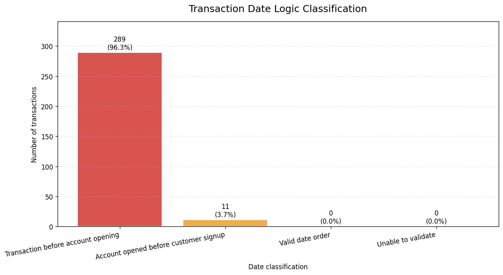
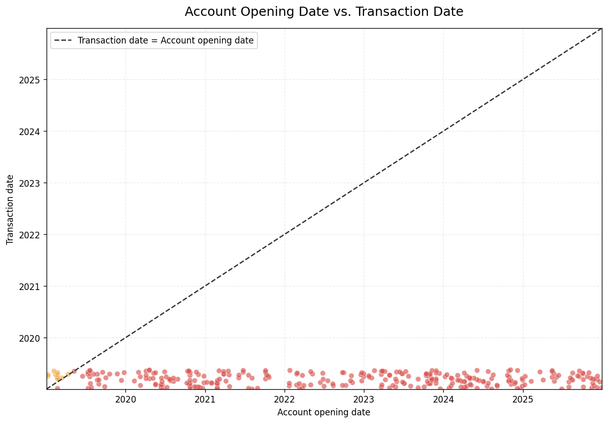
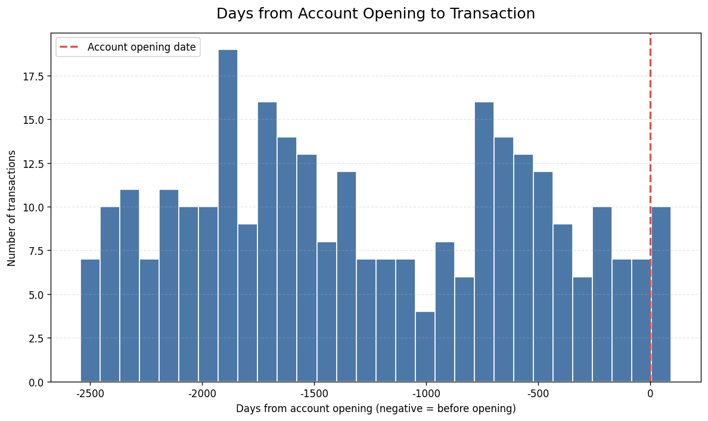
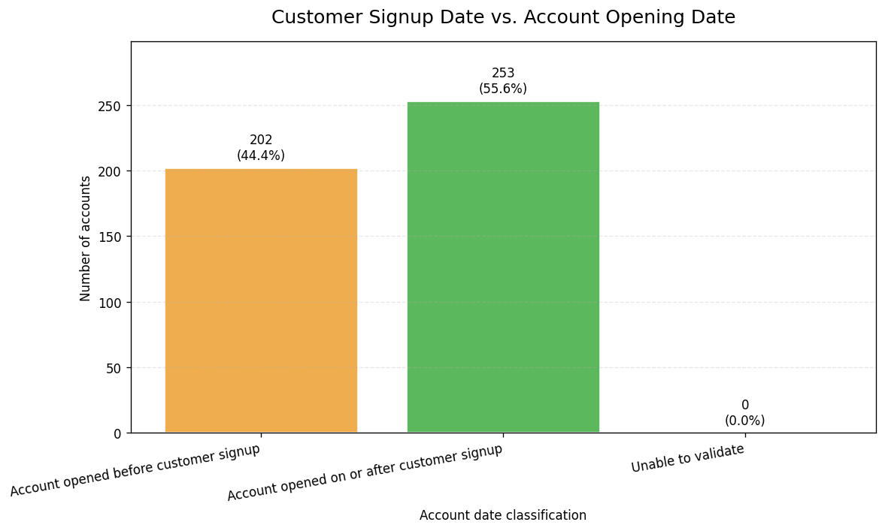

# 데이터 무결성 검증 — 분석 전에 데이터부터 의심하기 (GIGO 사례)

> 고객·계좌·거래 3개 테이블을 결합해 날짜 논리를 검증한 결과, **300건 중 정상 순서 거래 0건**.
> 분석을 멈추고 "이 데이터는 쓸 수 없다"는 근거를 수치로 제시한 프로젝트입니다.

| 항목 | 내용 |
|---|---|
| 기간 / 형태 | KB Bridge 부트캠프 Module 2 미니프로젝트 · 5인 팀 (K-aMazing) |
| 사용 기술 | Python (Pandas, Matplotlib) · SQL (SQLite) · Google Colab |
| 데이터 | 교육용 합성 데이터: 고객 300행 · 계좌 455행 · 거래 305행 |
| 핵심 결과 | 계좌 개설 전 거래 96.33%, 두 날짜 규칙을 모두 통과한 거래 0건 |

<!-- 내 역할: 실제 담당한 부분으로 수정해서 쓰세요. 예) 날짜 검증 로직 설계, 교차 집계, 시각화, 발표자료 작성 -->
**내 역할** : 팀원 (분석·검증 참여)

---

## 01. 프로젝트 배경

처음 받은 과제는 "신용점수 구간별 계좌 잔액 상관관계"와 "도시별 계좌유형 분포"를 분석하는 것이었습니다.
그런데 세 테이블을 결합하고 기본 품질을 확인하는 단계에서 **거래가 계좌 개설보다 먼저 일어난 기록**이 대량으로 나왔습니다.
시간 순서가 틀린 데이터로는 거래 기간, 신규 고객 활동, 계좌 이용 실적을 계산할 수 없기 때문에 주제를 **데이터 자체의 신뢰성 검증**으로 바꿨습니다.

## 02. 업무 문제

- 원본 데이터의 시간 순서 규칙 **가입일 ≤ 계좌 개설일 ≤ 거래일시** 가 지켜지고 있는가?
- 한 거래가 여러 규칙을 동시에 위반할 때, 단일 분류로 집계하면 무엇이 가려지는가?
- 오류 거래를 걸러낸 나머지(clean 파일)를 업무 분석에 써도 되는가?

## 03. 데이터 설명

| 파일 | 규모 | 용도 |
|---|---|---|
| `kaggle_customers.csv` | 300행 × 4열 | 고객번호, 도시, 신용점수, **가입일** |
| `kaggle_accounts.csv` | 455행 × 5열 | 계좌번호, 고객번호, 계좌유형, 잔액, **개설일** |
| `kaggle_transactions_dirty.csv` | 305행 × 4열 | 거래번호, 계좌번호, 거래금액, **거래일시** |
| `data/transaction_date_classification.csv` | 300행 × 15열 | 결합·검증 결과 (거래 단위) |
| `data/kaggle_transactions_clean.csv` | 11행 | 오류 거래를 제외한 기존 clean 파일 |

- 관계 구조: 고객(1) ─ 계좌(N) ─ 거래(N)
- 거래 데이터의 고유 계좌 224개, 고유 고객 156명
- 원본 3개 CSV는 과정 제공 자료라 저장소에는 결과 파일만 포함했습니다.

## 04. 데이터 전처리

| 점검 항목 | 결과 | 처리 |
|---|---|---|
| 거래번호 중복 | 5건 (완전 중복 행) | 검증용 사본에서 1건만 유지 → 300건 |
| 외래키 누락 (고아 계좌·거래) | 0건 | — |
| 한 계좌에 여러 고객 연결 | 0건 | 1:N 구조 정상 |
| 거래금액 결측 | 8건 (2.67%) | **0으로 채우지 않음** — 0원 거래와 의미가 다름 |
| 금액 형식 | `"$2,252.75"` 문자열 | `$`, `,` 제거 후 숫자 변환 |
| 날짜 형식 | 문자열 | `to_datetime(errors="coerce")` 변환, 실패 0건 |

- 결합은 `merge(..., validate="many_to_one")`으로 수행해 키 중복으로 행이 불어나는 것을 막았습니다.
- 오류 행을 삭제하지 않고 `오류_가입전개설`, `오류_개설전거래` **불리언 플래그 두 개**를 따로 만들어 원본 규모와 중복 위반을 보존했습니다.

## 05. SQL 분석

Pandas로 얻은 결과를 SQL로 다시 계산해 같은 값이 나오는지 교차 검증했습니다. → [`sql/date_integrity_check.sql`](sql/date_integrity_check.sql)

```sql
-- 규칙별 위반 건수 (두 규칙을 독립적으로 집계)
SELECT
    COUNT(*)                                            AS total_txn,
    SUM(txn_at < opened_at)                             AS txn_before_open,
    SUM(opened_at < signup_at)                          AS open_before_signup,
    SUM(txn_at < opened_at AND opened_at < signup_at)   AS both_violated,
    SUM(txn_at >= opened_at AND opened_at >= signup_at) AS valid_order,
    SUM(amt IS NULL)                                    AS amount_missing
FROM txn;
```

| total_txn | txn_before_open | open_before_signup | both_violated | valid_order | amount_missing |
|---:|---:|---:|---:|---:|---:|
| 300 | 289 | 137 | 126 | **0** | 8 |

```bash
python sql/run_sql.py   # CSV → SQLite 적재 후 쿼리 5개 실행
```

## 06. Python 분석

```python
df_merged['오류_가입전개설'] = df_merged['개설일'] < df_merged['가입일']
df_merged['오류_개설전거래'] = df_merged['거래일시'] < df_merged['개설일']
df_merged['날짜순서_정상'] = (
    df_merged[date_cols].notna().all(axis=1)
    & ~df_merged['오류_가입전개설']
    & ~df_merged['오류_개설전거래']
)
```

`if/elif`로 한 가지 오류만 붙이면 두 번째 오류가 집계에서 사라집니다. 그래서 규칙마다 독립 플래그를 만들고 교차표로 확인했습니다.

| | 가입 전 개설 O | 가입 전 개설 X | 합계 |
|---|---:|---:|---:|
| **개설 전 거래 O** | 126 | 163 | 289 |
| **개설 전 거래 X** | 11 | 0 | 11 |
| **합계** | 137 | 163 | 300 |

- 우선순위 분류에서는 "가입 전 개설"이 **11건**으로만 보이지만, 독립 집계하면 **137건(45.67%)**. 126건이 가려져 있었습니다.
- 계좌 단위로 보면 224개 중 218개는 모든 거래가 개설일 이전이었습니다.
- 전체 코드와 실행 결과: [`notebooks/`](notebooks/)

## 07. 시각화

| 분류별 거래 건수 | 개설일 vs 거래일시 |
|---|---|
|  |  |

| 개설 후 거래 경과일 분포 | 가입일 vs 개설일 |
|---|---|
|  |  |

- 대각선(거래일 = 개설일) 아래 점은 모두 "계좌가 생기기 전의 거래"입니다.
- 개설 시점을 0으로 둔 히스토그램에서 양수(정상) 영역이 비어 있습니다. 선행 일수 중앙값은 **1,413.5일**입니다.

## 08. 주요 인사이트

1. **개설 전 거래 289건 / 300건 (96.33%).** 거래일은 2019년 1~5월에 몰려 있는데 개설일은 2025년 12월까지 퍼져 있습니다. 몇 시간 시차로는 설명이 안 되는 규모라 추출·생성 단계의 결함이 의심됩니다.
2. **남은 11건도 전부 가입 전 개설.** 두 규칙을 모두 통과한 거래는 0건입니다.
3. **clean 파일의 함정.** clean 파일은 전체 거래의 3.67%, 금액 기준 3.17%(50,757달러)만 남은 표본이고, 그마저 한 규칙을 어깁니다. 여기서 나온 평균 거래금액 4,614달러를 고객 대표값으로 쓰면 안 됩니다.
4. **결론:** 초기 과제였던 신용점수-잔액 분석은 진행하지 않았습니다. 틀린 데이터에서 나온 그럴듯한 숫자가 가장 위험하다고 판단했습니다. (Garbage In, Garbage Out)

## 09. 생산·제조 업무 활용 방안

이 프로젝트의 핵심은 금융 지식보다 **"분석 전에 데이터가 현장 순서와 맞는지 확인하는 습관"**입니다. 생산 현장 데이터에도 같은 방식을 그대로 적용할 수 있습니다.

| 이 프로젝트 | 생산·제조 현장 적용 |
|---|---|
| 가입일 ≤ 개설일 ≤ 거래일시 | **자재 입고일 ≤ 공정 투입일 ≤ 생산 완료일 ≤ 검사일 ≤ 출하일** (LOT 이력 추적) |
| 고객-계좌-거래 1:N 외래키 검증 | 작업지시-LOT-검사성적서 연결 누락 확인 (MES/ERP 데이터 정합성) |
| 결측 금액을 0으로 채우지 않음 | 센서 결측값을 0으로 채우면 설비 정지로 오인 → 결측과 0을 구분해 관리 |
| 독립 플래그로 중복 위반 집계 | 한 제품에서 여러 불량 유형이 동시에 발생할 때 첫 번째 유형만 기록하면 파레토 분석이 왜곡됨 |
| 오류 원인 추정 → ETL 점검 제안 | 식스시그마 **Measure 단계**: 개선 분석 전에 측정·수집 체계부터 검증 |

**연결되는 경험:** 공공 하수처리시설에서 수질 분석값과 PLC 연동 설비 데이터를 다루며, 기록값이 실제 운전 상태와 맞지 않을 때 먼저 계측·기록 과정을 확인했던 경험과 같은 접근입니다.

## 10. 한계 및 개선 방향

- **교육용 합성 데이터**라 실제 금융기관의 오류율을 뜻하지 않습니다.
- 원본 3개 테이블이 제출 결과물에 없어 455개 계좌 집계(가입 전 개설 202개, 44.40%)는 독립적으로 재계산하지 못했습니다.
- "가입일"이 최초 고객 등록일인지 특정 서비스 가입일인지 정의에 따라 규칙 A의 해석이 달라집니다. → 데이터 사전(Data Dictionary) 확인이 먼저입니다.
- 개선 제안
  1. 데이터 추출(ETL) 쿼리의 날짜 필드 매핑 점검
  2. 입력 단계에서 DB 제약 조건(CHECK)으로 역순 날짜 차단
  3. 수정 후 오류율·결측률·정상 거래 수를 다시 집계하고 원래 분석 재개

---

### 폴더 구조

```
01_데이터무결성검증_GIGO/
├─ README.md
├─ notebooks/   # Colab 분석 노트북 (실행 결과 포함)
├─ sql/         # SQL 교차 검증 쿼리 + 실행 스크립트
├─ data/        # 검증 결과 CSV
├─ images/      # 시각화 4종
└─ docs/        # 최종 보고서 PDF
```
